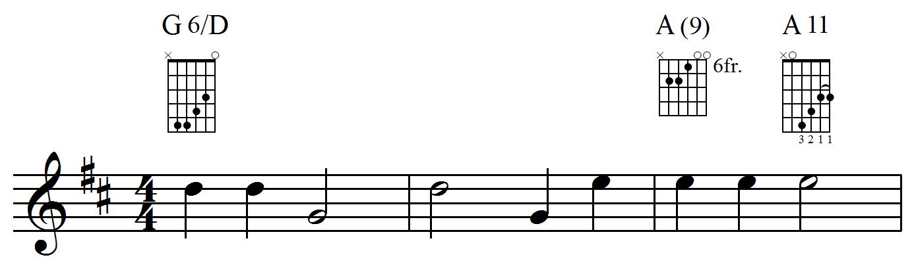

# 和弦符号和 和弦图

许多当代乐谱都使用和弦符号和和弦图。 在诸如乐谱，钢琴 / 人声 / 吉他编排，worship music 和 jazz big-band charts 等不同类型的乐谱中都可以找到这些音乐和声的符号。

MusicXML 的 `harmony` 元素对和声内容以及和弦符号和 和弦图的外观都提供了丰富的描述。它既可以用于和声分析，也可以用于和弦符号。和弦符号和 和弦图是最常见的用法，这就是我们在此处重点关注的内容。

## 和弦符号

这是个三小节的简单示例，它包含旋律以及和弦符号和图表，说明如何在吉他上弹奏和弦：



The first chord is a G major sixth chord with the fifth (D) in the bass. The second chord is notated as an A major chord with an added ninth degree. Another analysis might be to call it a dominant ninth chord with a missing seventh degree. MusicXML supports both types of analysis. For this example, we follow the written chord diagram notation. The third chord, an A11, will be discussed in the chord diagram section, as it includes both fingerings and a barre symbol.

这是在 MusicXML 文件中一个 G6 和弦的表示方式，暂时省略了和弦图：

```xml
<harmony default-y="100">
    <root>
        <root-step>G</root-step>
    </root>
    <kind halign="center" text="6">major-sixth</kind>
    <bass>
        <bass-step>D</bass-step>
    </bass>
</harmony>
```

每个和弦符号至少包含两个元素： `<root>` 元素表示和弦的根音，`kind` 元素表示和弦的类型。Here, we have a root of G and a kind of major-sixth. MusicXML 3.1 支持 33 种不同的 `kind` 元素值，在 direction.mod 文件中列出。The `kind` element has a `text` attribute that indicates that the chord is displayed as G6, not as Gmaj6, GM6, or other spelling that could represent the same chord. This symbol also indicates the bass of the chord, represented using the `bas`s element.

Both the `root` and the `bass` element divide the pitch into `step` and `alter` elements, similar to how the `pitch` element works. The `root` element uses the `root-step` and `root-alter` elements, while the `bass` element uses the `bass-step` and `bass-alter` elements. There is no element that corresponds to the `octave` element for pitch, since this information is not considered part of the harmonic analysis or the chord symbol.

MusicXML can represent all sorts of alterations to the built-in 33 kinds of chords. Degrees in the chord can be added, subtracted (e.g. “no 3”), or altered (e.g. “#5”). Here is how the second A(9) chord symbol is presented in MusicXML, using an added degree:

```xml
<harmony default-y="100">
    <root>
        <root-step>A</root-step>
    </root>
    <kind halign="center" parentheses-degrees="yes">major</kind>
    <degree>
        <degree-value>9</degree-value>
        <degree-alter>0</degree-alter>
        <degree-type text="">add</degree-type>
    </degree>
</harmony>
```

The `degree` element shows that we are adding an unaltered 9th degree to the chord, notating it with just the degree value (not as “add 9”) and with the added degrees in parentheses. The value of the `degree-type` element can be add, alter, or subtract. If the `degree-type` value is alter or subtract, the `degree-alter` value is relative to the degree already in the chord based on its `kind` element. If the `degree-type` value is add, the `degree-alter` value is relative to a dominant chord.

MusicXML 的 `harmony` 元素包含其他功能，以支持和声分析和格式设置。在 direction.mod 文件中有所有的详细信息。

## 和弦图

Chord diagrams, also known as chord frames, are used to indicate how a chord is played on a fretted instrument such as the guitar. The vertical lines in the chord diagrams represent strings, while the horizontal spaces represent frets. An x above a string indicates that the string is muted, while an o above a string represents an open string.

MusicXML 使用 `frame` 元素表现和弦图。Let us look at the `harmony` element for the first G6 chord again, this time including the `frame` element for the chord diagram:

```xml
<harmony default-y="100">
    <root>
        <root-step>G</root-step>
    </root>
    <kind halign="center" text="6">major-sixth</kind>
    <bass>
        <bass-step>D</bass-step>
    </bass>
    <frame default-y="83" halign="center"
           relative-x="5" unplayed="x" valign="top">
        <frame-strings>6</frame-strings>
        <frame-frets>5</frame-frets>
        <frame-note>
            <string>5</string>
            <fret>5</fret>
        </frame-note>
        <frame-note>
            <string>4</string>
            <fret>5</fret>
        </frame-note>
        <frame-note>
            <string>3</string>
            <fret>4</fret>
        </frame-note>
        <frame-note>
            <string>2</string>
            <fret>3</fret>
        </frame-note>
        <frame-note>
            <string>1</string>
            <fret>0</fret>
        </frame-note>
    </frame>
</harmony>
```

The `frame` element starts with `frame-strings` and `frame-fret` elements to indicate the size of the frame. Each string that is played is then represented with a `frame-note` element. The lowest string, string 6, is muted in this diagram, so it has no corresponding `frame-note` element. The highest string, string 1, is open, so its fret value is set to 0. The `frame` element’s `unplayed` attribute indicates what to display above a string like string 6 that has no `frame-note` element.

The positioning attributes indicate the vertical position of both the chord symbol text in the `harmony` element and the chord diagram in the `frame` element. The `valign` attribute of the `frame` element indicates that the default-y position represents the top of the chord diagram. The `halign` attribute indicate that both the chord symbol text and chord diagram are center-aligned.

In the second chord diagram, the first fret we see in the diagram corresponds to the sixth fret on the guitar. This is represented in MusicXML by the `first-fret` element. Unlike the other diagrams, this one shows only four frets.

Here is the `frame` element for the second chord diagram:

```xml
<frame default-y="83" halign="center"
       unplayed="x" valign="top">
    <frame-strings>6</frame-strings>
    <frame-frets>4</frame-frets>
    <first-fret location="right" text="6fr.">6</first-fret>
    <frame-note>
        <string>5</string>
        <fret>7</fret>
    </frame-note>
    <frame-note>
        <string>4</string>
        <fret>7</fret>
    </frame-note>
    <frame-note>
        <string>3</string>
        <fret>6</fret>
    </frame-note>
    <frame-note>
        <string>2</string>
        <fret>0</fret>
    </frame-note>
    <frame-note>
        <string>1</string>
        <fret>0</fret>
    </frame-note>
</frame>
```

The `text` attribute of the `first-fret` element shows how the text is displayed, and the location attribute indicates where it is displayed: to the right of the chord frame.

The third chord symbol adds fingerings and a barre indication. Here is the MusicXML `harmony` element for this symbol:

```xml
<harmony default-y="100">
    <root>
        <root-step>A</root-step>
    </root>
    <kind halign="center" text="11">dominant-11th</kind>
    <frame default-y="83" halign="center"
           unplayed="x" valign="top">
        <frame-strings>6</frame-strings>
        <frame-frets>5</frame-frets>
        <frame-note>
            <string>5</string>
            <fret>0</fret>
        </frame-note>
        <frame-note>
            <string>4</string>
            <fret>6</fret>
            <fingering>3</fingering>
        </frame-note>
        <frame-note>
            <string>3</string>
            <fret>4</fret>
            <fingering>2</fingering>
        </frame-note>
        <frame-note>
            <string>2</string>
            <fret>3</fret>
            <fingering>1</fingering>
            <barre type="start"/>
        </frame-note>
        <frame-note>
            <string>1</string>
            <fret>3</fret>
            <fingering>1</fingering>
            <barre type="stop"/>
         </frame-note>
    </frame>
</harmony>
```

The `fingering` element is used to indicate the fingering for each string in the diagram that is neither muted nor open. The `barre` element is used to indicate where a barre symbol starts and stops within the frame. The type is “start” for the lowest-pitched string and “stop” for the highestpitched string. This corresponds to the left-to-right order from low to high strings that is used in chord diagrams.
