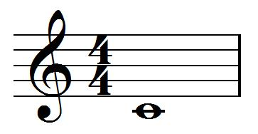

# MusicXML 中的「Hello World」

Brian Kernighan 和 Dennis Ritchie 普及了编写打印「hello，world」字样的程序的做法，这是学习一种新的编程语言时第一个要编写的程序。它是最小的程序，用于测试如何构建程序并显示其结果。

在 MusicXML 中，一首歌词为「hello，world」的歌曲实际上比我们所需的简单 MusicXML 文件复杂。让我们把事情变得更简单：一个单小节的音乐，其中包含以 4/4 拍为基础的中音 C 的全音符：



它在 MusicXML 中是这样的：

```xml
<?xml version="1.0" encoding="UTF-8" standalone="no"?>
<!DOCTYPE score-partwise PUBLIC
    "-//Recordare//DTD MusicXML 3.1 Partwise//EN"
    "http://www.musicxml.org/dtds/partwise.dtd">
<score-partwise version="3.1">
  <part-list>
    <score-part id="P1">
      <part-name>Music</part-name>
    </score-part>
  </part-list>
  <part id="P1">
    <measure number="1">
      <attributes>
        <divisions>1</divisions>
        <key>
          <fifths>0</fifths>
        </key>
        <time>
          <beats>4</beats>
          <beat-type>4</beat-type>
        </time>
        <clef>
          <sign>G</sign>
          <line>2</line>
        </clef>
      </attributes>
      <note>
        <pitch>
          <step>C</step>
          <octave>4</octave>
        </pitch>
        <duration>4</duration>
        <type>whole</type>
      </note>
    </measure>
  </part>
</score-partwise>
```

让我们依次看一下每个部分：

```xml
<?xml version="1.0" encoding="UTF-8" standalone="no"?>
```

这是所有 XML 文档所需的 XML 声明。我们已指定字符以 Unicode 编码「UTF-8」编写。这是以 ASCII 作为子集的 Unicode 版本。将 standalone 的值设置为 “no” 意味着我们正在使用另一个文件中的外部定义。

```xml
<!DOCTYPE score-partwise PUBLIC
    "-//Recordare//DTD MusicXML 3.1 Partwise//EN"
    "http://www.musicxml.org/dtds/partwise.dtd">
```

在这部分声明我们正在使用 MusicXML，并且声明一个小节包含在声部中的 partwise 乐谱。我们使用 PUBLIC 声明 DTD 的 Internet 位置。此声明中的 URL 仅供参考。大多数读取 MusicXML 文件的应用程序都希望在用户的计算机上安装 MusicXML DTD 的本地副本。在 XML 解析器中使用实体解析器对本地副本进行验证，而不是通过网络缓慢地读取 DTD。

如果您的应用程序要针对 MusicXML XSD 而不是 DTD 进行验证，则可以在 XML 解析器中使用实体解析器来执行此操作。编写 MusicXML 文件时，编写 DOCTYPE 可使所有基于 DTD 或 XSD 的应用更容易验证 MusicXML 文件。

```xml
<score-partwise version="3.1">
```

这是根文档类型。`<score-partwise>` 元素由声部组成，其中每个声部由小节组成。还有一个 `<score-timewise>` 选项，它由小节组成，其中每个小节均由声部组成。版本属性使程序可以更轻松地区分正在使用哪个 MusicXML 版本。如果要编写 MusicXML 1.0 文件，则将其省略。

```xml
  <part-list>
    <score-part id="P1">
      <part-name>Music</part-name>
    </score-part>
  </part-list>
```

不管是 partwise 乐谱还是 timewise 乐谱，MusicXML 文件都是以能够区分不同音乐声部的 header 开头。它列出了乐谱中不同的音乐部分。上面的示例是可能的最小 `part-list`：它包含一个 `score-part`，该声部的 id 属性以及所需的 `part-name`元素。

```xml
  <part id="P1">
```

现在，我们开始文档中的第一部分（在这种情况下，也是唯一的部分）。这里的 id 属性必须引用 header 中 `score-part` 的 id 属性。

```xml
    <measure number="1">
```

我们正在开始写第一声部的第一个小节。

```xml
      <attributes>
```

`attribute` 元素包含解析此声部中的音符和音乐数据所需的关键信息。

```xml
        <divisions>1</divisions>
```

MusicXML 中的每个音符都有一个 `duration` 元素。`divisions` 元素按每四分音符的分度提供了 `duration` 元素的度量单位。由于此文件中的所有内容都是一个完整的音符，因此我们不必除以四分音符，因此我们将 `duration` 设置为 1。

音符时值通常使用分数来表示，例如四分音符和八分音符。MusicXML 中的时值也是用分数来表示。由于分母几乎不需要更改，因此在 `divisions` 元素中将其分开表示，因此仅分子需要与每个单独的音符相关联。这类似于 MIDI 中用来表示音符时值的方案。

```xml
        <key>
          <fifths>0</fifths>
        </key>
```

`key` 元素用于声明调号。在此我们表示的是 C 大调，没有降调和升调，所以 `fifths` 元素的值为 0。如果表示升 2 调的 D 大调，`fifths` 元素的值应该设为 2。如果表示降 1 调的 F 大调，`fifths` 的值设为 -1。名字「fifths」来源于调号使用五度圈 (The circle of fifths) 表示。它使我们可以用一个元素来表示调号，而不是使用特定的元素升调和降调。

```xml
        <time>
          <beats>4</beats>
          <beat-type>4</beat-type>
        </time>
```

`time` 元素声明拍号。它的两个组成元素 `beats` 和 `beat-type` 分别表示拍号的分子和分母。

```xml
        <clef>
          <sign>G</sign>
          <line>2</line>
        </clef>
```

MusicXML 允许使用多种谱号，包括今天不再使用的。此处，标准高音谱号由五线谱第二行上的 G 谱号表示（例：五线谱从底部开始的第二行是 G）。

```xml
      </attributes>
      <note>
```

在此 `attributes` 结束，开始声明第一个音符。

```xml
        <pitch>
          <step>C</step>
          <octave>4</octave>
        </pitch>
```

`pitch` 元素必须有一个 `step` 和一个 `octave` 元素。如果音符包含降调或升调，也可以包含可选的 `alter` 元素。这些元素代表声音，所以如果音符使用了升降必须包含 `alter` 元素，即使升降出现在调号中。

在现在这种情况下，我们没有改动。`pitch step` 是 C。`octave` 的 4 表示八度以中央 C 开头。因此，此音符为中央 C。

```xml
        <duration>4</duration>
```

我们的 `divisions` 元素值为 1（表示一个四分音符），所以 4 时值就是 4 个四分音符的长度。

```xml
        <type>whole</type>
```

`<type>` 元素告诉我们这是个全音符。

你也完全可以从 `duration` 元素中得到它，但是对于标记和演奏都有的应用这更简单，尤其是标记和演奏数据独立表示时。无论如何，演奏和标记数据在实践中并不总是匹配。

For example, if you want to better approximate a swing feel than the equal eighth notes notated in a jazz chart, you might use different duration values while the type remains an eighth note. Bach's music contains examples of shorthand notation where the actual note durations do not match the standard interpretation of the notes on the page, due to his use of a notational shorthand for certain rhythms.

The `duration` element should reflect the intended duration, not a longer or shorter duration specific to a certain performance. The `note` element has attack and release attributes that suggest ways to alter a note's start and stop times from the nominal duration indicated directly or indirectly by the score.

```xml
      </note>
    </measure>
  </part>
</score-partwise>
```

至此，乐谱声明完毕。

XML 文档类型定义的一个限制是，如果要限制另一个元素中的元素数量，通常还必须限制它们的排序方式。例如，在 `attributes` 元素中，我们只需要一个 `divisions` 元素；对于音符的音高，我们只需要一个 `step` 和 `octave` 元素。为此，这些元素出现的顺序也必须被限定。

所以这些例子中元素出现的顺序很重要。DTD 应明确定义好了要求什么顺序；我们不会在本教程中详细说明。
