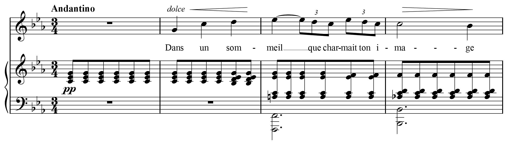

# Notation Basics in MusicXML

MIDI represents musical performance information, but leaves out a great deal of information about music notation. MusicXML represents this information, making it much more useful than MIDI for interchange between notation programs. In this section we describe the main elements used to represent music notation that go far beyond what is represented in MIDI files.

## How Music Looks vs. How Music Sounds

Let us look again at the example we used in the previous section - the first four bars of "Après un rêve" by Gabriel Fauré:



Clearly our discussion of the MIDI-compatible portion of MusicXML left out many thingsrepresented in this music. Where are the tempo and dynamic markings: the Andantino, pp, dolce,crescendo and diminuendo wedges? Where are stem directions stored? The downstem on theinitial G in the voice part is not what many programs would default to. How is the beamingrepresented, so that all the eighth notes are beamed together in the piano part, but separated intotriplets in the voice part? How are the piano chords split between staves? How are accidentalsindicated, including courtesy accidentals like the A-flat in the fourth bar?

A fundamental part of MusicXML is the distinction between elements that primarily represent thesound of the music versus those that represent its appearance. We discussed the sound elements inthe previous section, and they are of great use to applications dealing with MIDI or other soundfiles. Now we discuss the elements for musical appearance, which are of great use to musicnotation applications.

Here is what the beginning of the voice part looks like for "Après un rêve," up to the end of the first measure:

```xml
<part id="P1">
    <measure number="1">
        <attributes>
            <divisions>24</divisions>
            <key>
                <fifths>-3</fifths>
                <mode>minor</mode>
            </key>
            <time>
                <beats>3</beats>
                <beat-type>4</beat-type>
            </time>
            <clef>
                <sign>G</sign>
                <line>2</line>
            </clef>
        </attributes>
        <direction directive="yes" placement="above">
            <direction-type>
                <words default-y="15" font-weight="bold">Andantino</words>
            </direction-type>
            <sound tempo="60" />
        </direction>
        <note>
            <rest measure="yes" />
            <duration>72</duration>
            <voice>1</voice>
        </note>
    </measure>
```

And here is what the beginning of the piano part looks like for "Après un rêve," up to the first chord in the piano part. We will discuss the appearance elements used in these two examples in
the rest of this section.

```xml
<part id="P2">
    <measure number="1">
        <attributes>
            <divisions>2</divisions>
            <key>
                <fifths>-3</fifths>
                <mode>minor</mode>
            </key>
            <time>
                <beats>3</beats>
                <beat-type>4</beat-type>
            </time>
            <staves>2</staves>
            <clef number="1">
                <sign>G</sign>
                <line>2</line>
            </clef>
            <clef number="2">
                <sign>F</sign>
                <line>4</line>
            </clef>
        </attributes>
        <direction placement="below">
            <direction-type>
                <dynamics default-x="129" default-y="-75">
                    <pp />
                </dynamics>
            </direction-type>
            <staff>1</staff>
            <sound dynamics="40" />
        </direction>
        <note default-x="140">
            <pitch>
                <step>C</step>
                <octave>4</octave>
            </pitch>
            <duration>1</duration>
            <voice>1</voice>
            <type>eighth</type>
            <stem default-y="3">up</stem>
            <staff>1</staff>
            <beam number="1">begin</beam>
        </note>
        <note>
            <chord />
            <pitch>
                <step>E</step>
                <alter>-1</alter>
                <octave>4</octave>
            </pitch>
            <duration>1</duration>
            <voice>1</voice>
            <type>eighth</type>
            <stem>up</stem>
            <staff>1</staff>
        </note>
        <note>
            <chord />
            <pitch>
                <step>G</step>
                <octave>4</octave>
            </pitch>
            <duration>1</duration>
            <voice>1</voice>
            <type>eighth</type>
            <stem>up</stem>
            <staff>1</staff>
        </note>
```

## Attributes

### Staves

The staves element indicates the number of staves in a musical part, which in this case is 2 stavesfor the piano part. The staves element is optional. If it is not present, as is the case in the voicepart, there is 1 staff for the part.

### Clef

The clef element is used to indicate the clef for the staff. By specifying the clef's sign and its line,MusicXML handles both the common treble and bass clefs along with tenor, alto, percussion, tab,and older clefs. The treble clef definition indicates that the second line from the bottom of thestaff is a G; the bass clef definition indicates that the fourth line from the bottom of the staff is anF. The number attribute indicates the staff number if the part has more than one staff.

The clef element may also contain a clef-octave-change element after the line element. This isused for clefs that are written either an octave higher or lower than sounding pitch. For example,the tenor line in choral music is usually written in treble clef, an octave higher than the notesactually sound.

The clef for this part would be represented as:

```xml
<clef>
    <sign>G</sign>
    <line>2</line>
    <clef-octave-change>-1</clef-octave-change>
</clef>
```

While attributes usually appear at the start of a measure, they can appear anywhere within the measure. Mid-measure clef changes are the main use for this feature.

### Time

To represent common and cut time signatures, use the symbol attribute of the time element.

For common time, use:

```xml
<time symbol="common">
    <beats>4</beats>
    <beat-type>4</beat-type>
</time>
```

For cut time, use:

```xml
<time symbol="cut">
    <beats>2</beats>
    <beat-type>2</beat-type>
</time>
```

Without the symbol attribute, these time signatures would appear as 4/4 and 2/2, respectively.

## Musical Directions

Musical directions are used for the expression marks in a musical score that are not clearly tied to a particular note. The beginning of the voice part in measure 2, for instance, looks like this:

```xml
<direction placement="above">
    <direction-type>
        <words default-x="15" default-y="15" font-size="9" font-style="italic">dolce</words>
    </direction-type>
</direction>
<note default-x="27">
    <pitch>
        <step>G</step>
        <octave>4</octave>
    </pitch>
    <duration>24</duration>
    <voice>1</voice>
    <type>quarter</type>
    <stem default-y="6">down</stem>
    <lyric default-y="-80" number="1">
        <syllabic>single</syllabic>
        <text>Dans</text>
    </lyric>
</note>
<direction placement="above">
    <direction-type>
        <wedge default-y="20" type="crescendo" />
    </direction-type>
    <offset>-8</offset>
</direction>
```

This indicates that the "dolce" mark starts a little more than one space before the first note in a 9 point italic font, while the crescendo wedge starts two-thirds of the way between the first and second notes in the measure. The placement attribute is used to indicate whether the directions go above or below the staff. The default-x and default-y attributes provide more precise positioning, and use units of tenths of interline space. For these elements, the default-x attribute is measured from the start of the current measure (for other elements, it is measured from the left-hand side of the note or the musical position within the bar). The default-y element is measured from the top barline of the staff. The offset element measures horizontal distance in terms of divisions, just like the duration element.

If two directions go together, they can be linked by having multiple direction-type elementswithin a single direction. A MusicXML direction-type can contain many different elements,including words, dynamics, wedge, segno, coda, rehearsal, dashes, pedal, metronome, and octaveshift (for 8va and related marks).

Elements that continue over time have a type attribute to indicate the start and end points, as wellas positioning when continued over system breaks. For a wedge, the type may be crescendo,diminuendo, stop, or continue. For octave-shift, the choices are up, down, stop, or continue. Theshift indicates whether the note appears up or down from the sounding pitch, so the start of an 8vahas a type of down. For dashes, the choices are start or stop. For pedal, the choices are start, stop,sostenuto, continue, or change. The continue value is used with pedal lines to indicate a pedal liftand retake.

## Note Appearance

### Symbolic Note Types

Given the duration of a note and the divisions attribute, a program can usually infer the symbolicnote type (e.g. quarter note, dotted-eighth note). However, it is much easier for notation programsif this is represented explicitly, rather than making the program infer the correct symbolic value.In some cases, the intended note duration does not match what is written, be it some of Bach'sdotted notations, notes inégales, or jazz swing rhythms.

The type element is used to indicate the symbolic note type, such as quarter, eighth, or 16th.MusicXML symbolic note types range from 1024th notes to maxima notes: 1024th, 512th, 256th,128th, 64th, 32nd, 16th, eighth, quarter, half, whole, breve, long, and maxima. The type elementmay be followed by one or more empty dot elements to indicate dotted notes.

## Tuplets

The time-modification element is used to make it easier for applications to handle tuplets properly. For a normal triplet, this would look like:

```xml
<time-modification>
    <actual-notes>3</actual-notes>
    <normal-notes>2</normal-notes>
</time-modification>
```

This indicates that three notes are placed in the time usually allotted for two notes.

There is an optional normal-type element that is used when the type of the note does not match the type of the normal-notes in the triplet. Say you have an eighth note triplet, but instead of three eighth notes, you have a quarter note and eighth note instead. Without a normal-type element, software that reads the quarter note in the tuplet will likely assume that this is starting a quarternote triplet, not an eighth note triplet. In this case, the symbolic type and tuplet would be encoded as:

```xml
<type>quarter</type>
    <time-modification>
        <actual-notes>3</actual-notes>
        <normal-notes>2</normal-notes>
        <normal-type>eighth</normal-type>
    </time-modification>
```

The time-modification element cannot represent all aspects of tuplets, such as detailed formatting and where nested tuplets begin and end. It is recommended that the tuplet element also be used to notate where tuplets begin and end, along with any additional formatting details that may be needed. The tuplet element is a child of the notations element described below.

## Stems

Stem direction is represented with the stem element, whose value can be up, down, none, or double. For up and down stems, the default-y attribute represents where the stem ends, measured in tenths of interline space from the top line of the staff.

## Beams

Beams are represented by beam elements. Their value can be begin, continue, end, forward hook, and backward hook. Each element has a beam-level attribute which ranges from 1 to 8 for eighthnote to 256th-note beams.

## Accidentals

The accidental element represents actual notated accidentals. The most common values are sharp, flat, natural, double-sharp, and flat-flat. Many microtonal accidental values are also available. An accidental element has optional courtesy and editorial attributes to indicate courtesy and editorial accidentals. The bracket, parentheses, and size attributes offer more precise visual representations for these types of accidentals.

## Notations

Many additional elements can be associated with a note. In MusicXML, these are collected underthe notations object. Tied notes, slurs, tuplets, fermatas, and arpeggios are represented by toplevel children of the notations element. Dynamics, ornaments, articulations, and technicalindications specific to particular instruments are also top-level children of the notations element.A staccato mark would then be placed within the articulations element.

The tied element represents the visual part of a tie, and the tuplet element represents the visualpart of a tuplet. The tie element affects the sound, and the time-modification affects placement,but the tied and tuplet elements indicate that there is something to see on the score indicating thetie or tuplet. (With ties, the two nearly always go together, but with tuplets this is not the case.)The second E-flat in measure 3 of the voice part, which is the end of a tie and start of a tuplet, isrepresented as:

```xml
<note>
    <pitch>
        <step>E</step>
        <alter>-1</alter>
        <octave>5</octave>
    </pitch>
    <duration>4</duration>
    <tie type="stop" />
    <voice>1</voice>
    <type>eighth</type>
    <time-modification>
        <actual-notes>3</actual-notes>
        <normal-notes>2</normal-notes>
    </time-modification>
    <stem>down</stem>
    <notations>
        <tied type="stop" />
        <tuplet bracket="no" number="1" placement="above" type="start" />
    </notations>
</note>
```

Slur, tied, and tuplet elements all have a number attribute to distinguish overlapping graphical elements.

Full details for all the different notations can be found in their definitions in the note.mod file.

## Multi-Part Music

MusicXML contains two elements to help distinguish what is happening in multi-part music: the voice and staff elements.

A staff element should be used wherever possible in multi-staff music like piano parts. Note, forward, and direction elements can all include a staff element. The first cross-staff chord in measure 3 of the piano part is represented as:

```xml
<note default-x="26">
    <pitch>
        <step>A</step>
        <octave>3</octave>
    </pitch>
    <duration>1</duration>
    <voice>1</voice>
    <type>eighth</type>
    <accidental>natural</accidental>
    <stem default-y="91">up</stem>
    <staff>2</staff>
    <beam number="1">begin</beam>
</note>
<note default-x="26">
    <chord />
    <pitch>
        <step>C</step>
        <octave>4</octave>
    </pitch>
    <duration>1</duration>
    <voice>1</voice>
    <type>eighth</type>
    <stem>up</stem>
    <staff>2</staff>
</note>
<note default-x="26">
    <chord />
    <pitch>
        <step>E</step>
        <alter>-1</alter>
        <octave>4</octave>
    </pitch>
    <duration>1</duration>
    <voice>1</voice>
    <type>eighth</type>
    <stem>up</stem>
    <staff>1</staff>
</note>
<note default-x="26">
    <chord />
    <pitch>
        <step>G</step>
        <octave>4</octave>
    </pitch>
    <duration>1</duration>
    <voice>1</voice>
    <type>eighth</type>
    <stem>up</stem>
    <staff>1</staff>
</note>
```

The voice element helps keep track of multiple independent voice parts. Specifying the voicemakes it much easier to import MusicXML files into other programs that handle multiple voices,such as Finale with its layer feature. In the piano chord above, having all the notes be part of achord in voice 1 but with different staff elements ensures that this will be represented as a crossstaff chord. After completing the six chords in the right-hand part, the left-hand chord isrepresented as a chord in voice 2, using:

```xml
<backup>
    <duration>6</duration>
</backup>
<note default-x="26">
    <pitch>
        <step>F</step>
        <octave>1</octave>
    </pitch>
    <duration>6</duration>
    <voice>2</voice>
    <type>half</type>
    <dot />
    <stem default-y="-105.5">down</stem>
    <staff>2</staff>
</note>
<note default-x="26">
    <chord />
    <pitch>
        <step>F</step>
        <octave>2</octave>
    </pitch>
    <duration>6</duration>
    <voice>2</voice>
    <type>half</type>
    <dot />
    <stem>down</stem>
    <staff>2</staff>
</note>
```
