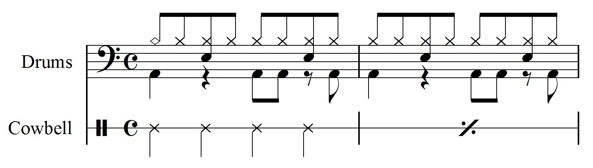

# 打击乐器

打击乐器可以是有音高或者无音高的。具有定音高的打击乐器（例如定音鼓或槌乐器）是使用正常的音乐符号处理的。

When the instrument has no definite pitch, like a bass drum or snare drum, notation gets stretched. The use of vertical space to represent pitch instead is used to represent different instruments. Yet sometimes we have more percussion instruments handled by one player than can fit into the lines on a staff. In other cases, we may have only one unpitched instrument to notate, where the vertical space on a 5-line staff would be wasted.

MusicXML 允许使用几种功能将打击乐表示为声音和乐谱：

- 通过指定在谱线上的位置直观地表示无音高的乐器。
- 和 TAB 谱一样，谱线可能会高过或少于 5 行。
- Specifying multiple instruments per part
- Specifying the MIDI playback for each instrument (for instance, by a single MIDI pitch in a percussion kit).
- Alternate notehead shapes let multiple instruments to share a single line on the staff.

## Unpitched Notes

为了说明 MusicXML 的打击乐器功能，以下是两个演奏者的两个音色示例：一个在架子鼓上，一个在牛铃上：



In the drum part, the top space (B in bass clef) is used for the cymbal (diamond notehead) and hihat (x notehead). The E space is used for the snare drum, and the bottom A space is used for the bass drum. The cowbell player has only one instrument, so it is represented on a one-line staff.

Since these notes have no definite pitch, it would be misleading to represent them using the pitch element. An analysis program looking for a series of repeated B's should not return this piece of music. Neither should a program looking for a series of repeated F-sharps, based on the General MIDI pitch for a closed hi-hat.

Instead, we represent percussion and other unpitched instruments with the unpitched element. As with rests, there are display-step and display-octave elements to indicate where the note should appear on the staff, based on the current clef. So the cymbal and hi-hat notes on this bass clef staff are represented as:

```xml
<unpitched>
    <display-step>B</display-step>
    <display-octave>3</display-octave>
</unpitched>
```

Percussion clef is treated like treble clef when determining the display-step and display-octave. So if this part had been notated in percussion clef instead of bass clef, the resulting MusicXML would be:

```xml
<unpitched>
    <display-step>G</display-step>
    <display-octave>5</display-octave>
</unpitched>
```

## Staff Lines

The cowbell part is an example where one player has one instrument, so the part is notated on one line both for clarity and saving space. The single line is specified within the attributes element for the part:

```xml
<attributes>
  <divisions>2</divisions>
  <key>
    <fifths>0</fifths>
    <mode>major</mode>
  </key>
  <time symbol="common">
    <beats>4</beats>
    <beat-type>4</beat-type>
  </time>
  <clef>
    <sign>percussion</sign>
  </clef>
  <staff-details>
    <staff-lines>1</staff-lines>
  </staff-details>
</attributes>
```

How do we determine the display-step and display-octave for a one-line staff? Since the percussion clef is treated like a treble clef, the G in octave 4 is on the second line of the staff. For this one-line staff, that G is one imaginary line above the staff (for a 2-line staff, it's the top line, and the middle line on a 3-line staff). Therefore the unpitched elements for the cowbell part are:

```xml
<unpitched>
    <display-step>E</display-step>
    <display-octave>4</display-octave>
</unpitched>
```

## Multiple Instruments Per Part

Percussion parts are one case of many where multiple instruments are sharing the same part. This  is represented in MusicXML by including more than one score-instrument element within a  score-part. Each note can then contain an instrument element that refers back to the id of the  score-instrument. Note that the score-instrument id must be unique throughout the entire piece.  Two score-part elements cannot each have a score-instrument element with the same id.

To represent MIDI playback for each instrument, we add a midi-instrument element for each  score-instrument. In this case, we are using a General MIDI instrument, so we include a midichannel of 10 for each instrument. We then use the midi-unpitched element to indicate the MIDI  pitch that corresponds to a particular sound in a General MIDI drum kit.

The `part-list` for our two-bar example looks like this:

```xml
<part-list>
  <score-part id="P1">
    <part-name>Drums</part-name>
    <score-instrument id="P1-X4">
      <instrument-name>Snare Drum</instrument-name>
    </score-instrument>
    <score-instrument id="P1-X2">
      <instrument-name>Kick Drum</instrument-name>
    </score-instrument>
    <score-instrument id="P1-X13">
      <instrument-name>Crash Cymbal</instrument-name>
    </score-instrument>
    <score-instrument id="P1-X6">
      <instrument-name>Hi-Hat%g Closed</instrument-name>
    </score-instrument>
    <midi-instrument id="P1-X4">
      <midi-channel>10</midi-channel>
      <midi-program>1</midi-program>
      <midi-unpitched>39</midi-unpitched>
    </midi-instrument>
    <midi-instrument id="P1-X2">
      <midi-channel>10</midi-channel>
      <midi-program>1</midi-program>
      <midi-unpitched>37</midi-unpitched>
    </midi-instrument>
    <midi-instrument id="P1-X13">
      <midi-channel>10</midi-channel>
      <midi-program>1</midi-program>
      <midi-unpitched>50</midi-unpitched>
    </midi-instrument>
    <midi-instrument id="P1-X6">
      <midi-channel>10</midi-channel>
      <midi-program>1</midi-program>
      <midi-unpitched>43</midi-unpitched>
    </midi-instrument>
  </score-part>
  <score-part id="P2">
    <part-name>Cowbell</part-name>
    <score-instrument id="P2-X1">
      <instrument-name>Cowbell</instrument-name>
      <instrument-sound>metal.bells.cowbell</instrument-sound>
    </score-instrument>
    <midi-instrument id="P2-X1">
      <midi-channel>10</midi-channel>
      <midi-program>1</midi-program>
      <midi-unpitched>57</midi-unpitched>
    </midi-instrument>
  </score-part>
</part-list>
```

Each note then includes an `unpitched` element to show where the note is on the staff, and an `instrument` element to indicate which instrument is used and how to play it back using MIDI. The first kick drum note looks like this:

```xml
<note default-x="78">
  <unpitched>
    <display-step>A</display-step>
    <display-octave>2</display-octave>
  </unpitched>
  <duration>2</duration>
  <instrument id="P1-X2"/>
  <voice>2</voice>
  <type>quarter</type>
  <stem default-y="-65.5">down</stem>
</note>
```

Finale creates these instrument names like "P1-X2" to make it easy to generate unique names for each score instrument. It would be better to use more readable names that are still unique across the entire piece.

## Notehead Shapes

The one remaining task is to specify the alternate noteheads that distinguish the hi-hat from the cymbal. While the MusicXML playback can distinguish these by the use of different instruments, a drummer will certainly appreciate having different notehead shapes for different instrument on the same line.

The MusicXML `notehead` element specifies these different shapes. Values can be slash, triangle, diamond, square, cross, x, circle-x, inverted triangle, arrow down, arrow up, circled, slashed, back slashed, normal, cluster, circle dot, left triangle, rectangle, none, do, re, mi, fa, fa up, so, la, ti, and other. Enclosed shapes like normal, diamond, triangle, and square can use the filled attribute to indicate a filled or hollow shape.

The first two notes of the cymbal/hi-hat line look like this:

```xml
  <note default-x="78">
    <unpitched>
      <display-step>B</display-step>
      <display-octave>3</display-octave>
    </unpitched>
    <duration>1</duration>
    <instrument id="P1-X13"/>
    <voice>1</voice>
    <type>eighth</type>
    <stem default-y="40">up</stem>
    <notehead filled="no">diamond</notehead>
    <beam number="1">begin</beam>
  </note>
  <note default-x="109">
    <unpitched>
      <display-step>B</display-step>
      <display-octave>3</display-octave>
    </unpitched>
    <duration>1</duration>
    <instrument id="P1-X6"/>
    <voice>1</voice>
    <type>eighth</type>
    <stem default-y="40">up</stem>
    <notehead>x</notehead>
    <beam number="1">continue</beam>
  </note>
```

The filled attribute on the notehead element is also useful for multi-part piano music. There are many cases where, for instance, a downstem half note shares a hollow notehead with an upstem eighth note. The eighth note can specify that it uses an unfilled normal notehead, making things display correctly when moving back and forth between notation programs.

## Measure Styles

Our cowbell part also shows the use of a one-bar repeat symbol. This and similar repeats and multimeasure rests are represented using the measure-style element. The music in the second bar should be specified just as in the first bar (four notes with display-step E, display-octave 4, and instrument P2-X1). At the start of the bar, we indicate the beginning of the one-measure repeat style:

```xml
<measure number="2">
    <attributes>
        <measure-style>
            <measure-repeat type="start">1</measure-repeat>
        </measure-style>
    </attributes>
```

Further details about the measure-style element can be found in the attributes.mod file.
