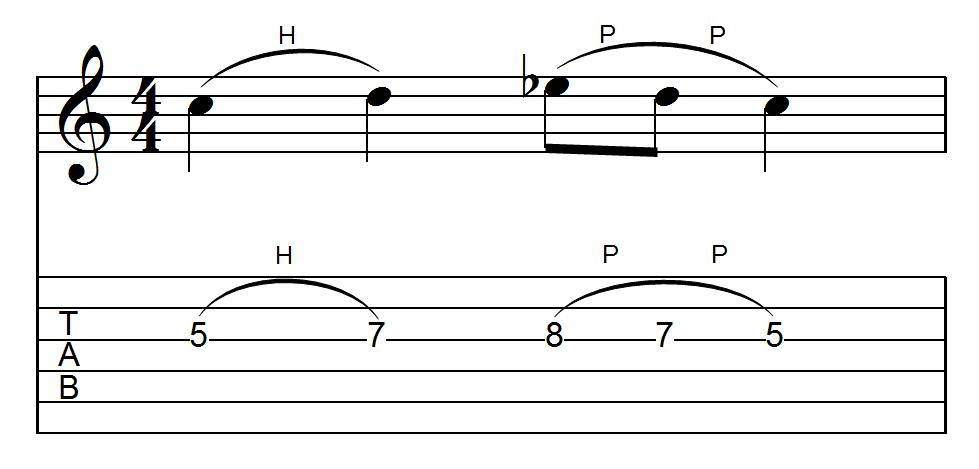

# 弦乐器

六线谱为直接在吉他或其他弦乐器上演奏音乐的弦和品格提供了直接的指导，但通常会牺牲精确的节奏信息。在 MusicXML 中，尽管可能隐藏在六线谱上，但仍需要指定节奏信息。需要添加的主要内容是品格和琴弦信息，琴弦调音的详细信息以及吉他和其他相关乐器特有的技术。

## 品格和琴弦

这是一个简单的单小节吉他声部的示例，我们将使用标准的六弦吉他调音来说明 MusicXML 基本六线谱功能：



生成吉他和其他弦乐器的六线谱所需的品格和弦信息与其他乐器（如钢琴指法和小提琴弓）的技术指示的处理方式相同。 `technical` 元素包含这些类型的符号，其两个组成元素表示音符的品格和字符串。品格从 0 开始编号，0 代表空弦。乐器上最高的弦从 1 开始编号。

在此示例中，第一个音符的品格和琴弦使用以下方式表示：

```xml
<technical>
    <string>3</string>
    <fret>5</fret>
</technical>
```

## 调弦

`attributes` 元素可以包括一个 `staff-details` 元素，以指定 TAB 谱线的细节。`staff-lines` 元素指定 TAB 谱上的行数，通常每根琴弦一行。琴弦调音以 `staff-tuning` 和 `capo` 元素描述。 TAB 是 `clef` 元素可用的值之一。`key` 元素的 `print-object` 属性用于指示不应在此谱线上显示调号。

示例中的吉他声部以下列属性开头：

```xml
<attributes>
    <divisions>2</divisions>
    <key print-object="no">
        <fifths>0</fifths>
        <mode>major</mode>
    </key>
    <clef>
        <sign>TAB</sign>
        <line>5</line>
    </clef>
    <staff-details>
        <staff-lines>6</staff-lines>
        <staff-tuning line="1">
            <tuning-step>E</tuning-step>
            <tuning-octave>2</tuning-octave>
        </staff-tuning>
        <staff-tuning line="2">
            <tuning-step>A</tuning-step>
            <tuning-octave>2</tuning-octave>
        </staff-tuning>
        <staff-tuning line="3">
            <tuning-step>D</tuning-step>
            <tuning-octave>3</tuning-octave>
        </staff-tuning>
        <staff-tuning line="4">
            <tuning-step>G</tuning-step>
            <tuning-octave>3</tuning-octave>
        </staff-tuning>
        <staff-tuning line="5">
            <tuning-step>B</tuning-step>
            <tuning-octave>3</tuning-octave>
        </staff-tuning>
        <staff-tuning line="6">
            <tuning-step>E</tuning-step>
            <tuning-octave>4</tuning-octave>
        </staff-tuning>
    </staff-details>
</attributes>
```

## 击弦和勾弦

当代吉他符号包含许多吉他特有的元素（特别是电吉他）。虽然在当前的 MusicXML 软件中偶尔支持 harmonics 和 bends 之类的元素，但在 Finale 和其他应用程序中均支持击弦和勾弦。

These elements are represented as technical indications that often go together with a notated slur. In the first half of the bar, a single hammer-on goes together with a single slur:

```xml
<note default-x="82">
    <pitch>
        <step>C</step>
        <octave>4</octave>
    </pitch>
    <duration>2</duration>
    <voice>1</voice>
    <type>quarter</type>
    <stem>none</stem>
    <notations>
        <technical>
            <hammer-on number="1" type="start">H</hammer-on>
            <string>3</string>
            <fret>5</fret>
        </technical>
        <slur number="1" placement="above" type="start"/>
     </notations>
</note>
<note default-x="177">
    <pitch>
        <step>D</step>
        <octave>4</octave>
    </pitch>
    <duration>2</duration>
    <voice>1</voice>
    <type>quarter</type>
    <stem>none</stem>
    <notations>
        <technical>
            <hammer-on number="1" type="stop"/>
            <string>3</string>
            <fret>7</fret>
        </technical>
        <slur number="1" type="stop"/>
    </notations>
</note>
```

But in the second half of the bar, a single slur goes together with two pull-offs:

```xml
  <note default-x="272">
    <pitch>
      <step>E</step>
      <alter>-1</alter>
      <octave>4</octave>
    </pitch>
    <duration>1</duration>
    <voice>1</voice>
    <type>eighth</type>
    <stem>none</stem>
    <notations>
      <technical>
        <pull-off number="1" type="start">P</pull-off>
        <string>3</string>
        <fret>8</fret>
      </technical>
      <slur number="1" placement="above" type="start"/>
    </notations>
  </note>
  <note default-x="330">
    <pitch>
      <step>D</step>
      <octave>4</octave>
    </pitch>
    <duration>1</duration>
    <voice>1</voice>
    <type>eighth</type>
    <stem>none</stem>
    <notations>
      <technical>
        <pull-off number="1" type="stop"/>
        <pull-off number="1" type="start">P</pull-off>
        <string>3</string>
        <fret>7</fret>
      </technical>
    </notations>
  </note>
  <note default-x="389">
    <pitch>
      <step>C</step>
      <octave>4</octave>
    </pitch>
    <duration>2</duration>
    <voice>1</voice>
    <type>quarter</type>
    <stem>none</stem>
    <notations>
      <technical>
        <pull-off number="1" type="stop"/>
        <string>3</string>
        <fret>5</fret>
      </technical>
      <slur number="1" type="stop"/>
    </notations>
  </note>
```
