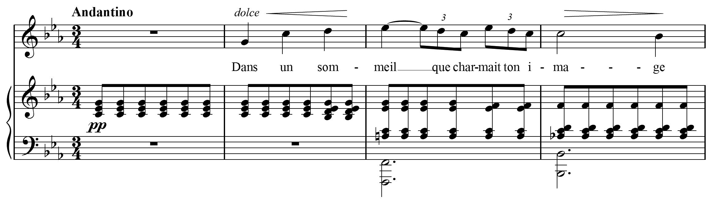
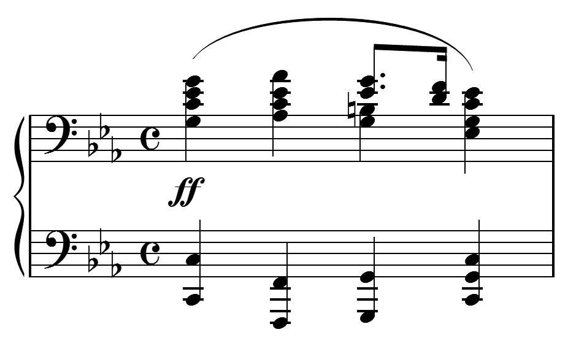

# MusicXML 中 MIDI 兼容的部分

MusicXML 音乐数据主要包含两种类型的元素。一组元素主要用于表示声音。这些是从 MusicXML 创建 MIDI 文件时使用的元素。另一组主要用于表示乐谱的外观。

我们鼓励编写 MusicXML 的程序编写尽可能多的准确数据。但是，唯一必需的元素是与从 MusicXML 写入 MIDI 文件直接相关的声音元素。这是我们开始介绍 MusicXML 文件的音乐元素的地方。

例如，GabrielFauré 的 Aprèsunrêve 的前四个小节：



## Attributes

`attributes` 元素包含有关拍号，调号，移调，谱号和其他音乐数据的信息，这些信息通常是在乐曲的开头或小节的开头指定的。我们在这里讨论 MIDI 兼容的元素。其余各节将在以下各节中讨论。

以下是在此示例中的 MIDI 兼容属性：

```xml
<attributes>
    <divisions>24</divisions>
    <key>
        <fifths>-3</fifths>
        <mode>minor</mode>
    </key>
    <time>
        <beats>3</beats>
    <beat-type>4</beat-type>
    </time>
</attributes>
```

### Divisions

音符时值通常用分数表示：全音符，二分音符，四分音符等。尽管每个音符都可以与之相关联，但是 MusicXML 却遵循 MIDI，方法是在音乐声部的开头指定每四分音符的分度 (divisions)，然后根据这些分度来指定音符的时值。

MusicXML 允许在声部中更改 divisions，但是大多数软件会发现最容易计算出每个声部的 divisions 并将其放在第一个小节的开头。在此示例中，divisions 的值为 24 允许两个三连音八分音符 (duration of 8) 和常规十六分音符(duration of 6)。

### 调号

标准调号非常类似于 MIDI 调号。`fifths` 元素定义了调号中的升调或降调，升调为正，降调为负。`fifths` 元素中的值代表调号在五度圈中的位置。MusicXML 使用 `mode` 元素表示大调 (major) 或小调 (minor)。

### 拍号

在 MusicXML 中，标准拍号的表示比在 MIDI 中更简单。`beats` 元素表示拍号的分子，`beats-type` 元素表示分母。

### 移调

如果要为移调乐器编写声部，则必须在 MusicXML 中指定移调，以使声音输出正确。The `transpose` 元素表示 what must be added to the written pitch to get the correct sounding pitch。

`chromatic` 元素表示半音阶 (chromatic steps)，是一个必要的元素。The `diatonic`, `octave-change`, and `double`e elements are elements.

假设我们有一个用 ♭B 写的小号声部。在此声部上写的 C 在钢琴上的发音为 ♭B。这个变调是下降一个全音 (C -> B) 或下降两个半音 (C -> B -> ♭B)。在 MusicXML 中，它表示为：

```xml
<transpose>
    <diatonic>-1</diatonic>
    <chromatic>-2</chromatic>
</transpose>
```

正确的 MIDI 输出不需要 `diatonic` 元素，但是它有助于正确设置移调符号，并鼓励程序尽可能使用它。

当移调在任意方向都超过一个八度时，将使用 `octave-change` 元素。当声部降低两个八度时，将使用 `double` 元素，例如，大提琴和低音提琴都使用单个声部时。

## 音高

音高，时值，连音和歌词都在 `note` 元素中表示。例如，在人声声部的第三小节开始的♭E 具有以下 MIDI 兼容元素：

```xml
<note>
    <pitch>
      <step>E</step>
      <alter>-1</alter>
      <octave>5</octave>
    </pitch>
    <duration>24</duration>
    <tie type="start"/>
    <lyric>
      <syllabic>end</syllabic>
      <text>meil</text>
      <extend />
    </lyric>
</note>
```

在 MIDI 中，音高使用一个数字表示。MusicXML 将音高分为三个部分：`step` 元素（C, D, E, F, G, A, B），可选的 `alter` 元素（-1 降调，1 升调），和 `octave` 元素（以中央 C 开头的八度为 4）。

音高代表声音而不是标记，所以即使代表调号的升降，也必须包含一个 `alter` 元素。这就是 ♭E 包含 `alter` 元素的原因，即使标记上没有变音记号。

`alter` 值为 -2 和 2 时用于双降调和双升调。小数值可以用于微调（例如，0.5 为升四分之一调），但并非所有程序都可以将其转换为 MIDI 数据。

对于休止符，使用 `rest` 代替 `pitch` 元素。在人声声部的全休止符表示为：

```xml
<note>
    <rest measure="yes" />
    <duration>72</duration>
</note>
```

## 时值

`duration` 元素是一个整数，divisions 的倍数表示一个音符的时值。因为我们例子中一个四分音符的 divisions 值为24，所以一个四分音符的 `duration` 值是24。八分三连音中的一个音符 `duration` 是8，一个八分音符 `duration` 值为 12。

## 连结音

连结音的发声部分由 `tie` 元素指示。tie 元素的 `type` 为连结音的开始音符为 `start`，`stop` 为连结音的结束音符。一个 `note` 元素可以有两个 `tie` 元素。如果一个音符与该音符之前和之后的音符都绑定在一起，则将 `<tie type ="stop">` 放在 `<tie type ="start">` 之前。

## 和弦

MusicXML 中的 `duration` 元素可移动音乐计数器。要弹奏和弦，我们需要指出一个音符应该与前一个音符同时开始，而不是跟随前一个音符。要在 MusicXML 中执行此操作，请在音符中添加一个 `chord` 元素。

在我们的示例中，钢琴声部的节奏不比八分音符复杂，因此我们的转换器将分度值设置为 2。每四分音符 2 分度，钢琴声部中第一和弦的声音部分表示为：

```xml
<note>
    <pitch>
        <step>C</step>
        <octave>4</octave>
    </pitch>
    <duration>1</duration>
</note>
<note>
    <chord />
    <pitch>
        <step>E</step>
        <alter>-1</alter>
        <octave>4</octave>
    </pitch>
    <duration>1</duration>
</note>
<note>
    <chord />
    <pitch>
        <step>G</step>
        <octave>4</octave>
    </pitch>
    <duration>1</duration>
</note>
```

每个和弦中的音符，在 `pitch` 元素前的第一个元素都是 `chord`。

如果发现和弦中的音符具有不同的时值，则最好将其表示为多声部音乐，而不是和弦。 如果您的和弦中必须有不同时值的音符，则最长的音符必须是和弦中的第一音符。

## 歌词

虽然歌词尚未用于声音生成，但它们已包含在标准 MIDI 文件中，因此我们将在此处与 MusicXML 的其他 MIDI 兼容功能进行讨论。

MusicXML 中的歌词使用可选的 `syllabic` 元素来指示音节如何适应单词，而不是像某些其他格式那样基于连字符和空格的约定。`syllabic` 的值可以是 single，begin，end 或 middle。

前面我们看到，以 ♭E 开头的第三小节的 `syllabic` 值为 end，因为 meil 是两个音节单词的结尾。 image 中的 ma 音节的 `syllabic` 值为 middle。在第二小节，音符为：

```xml
<note>
    <pitch>
        <step>G</step>
        <octave>4</octave>
    </pitch>
    <duration>24</duration>
    <lyric>
        <syllabic>single</syllabic>
        <text>Dans</text>
    </lyric>
</note>
<note>
    <pitch>
        <step>C</step>
        <octave>5</octave>
    </pitch>
    <duration>24</duration>
    <lyric>
        <syllabic>single</syllabic>
        <text>un</text>
    </lyric>
</note>
<note>
    <pitch>
        <step>D</step>
        <octave>5</octave>
    </pitch>
    <duration>24</duration>
    <lyric>
        <syllabic>begin</syllabic>
        <text>som</text>
    </lyric>
</note>
```

歌词的实际文本在 `text` 元素中指定。一个音符可能有多个音节，在这种情况下，多个 `syllabic` / `text` 元素对 应该用 `elision` 元素分开。可以通过使用 `extend` 元素来指示单词扩展名，如上面的 "meil" 音节一样。

多段歌词使用多个 `lyric` 元素表示。`number` 和 `name` 属性可用于区分它们：第一段歌词为 `<lyric number="1">`，第二段为 `<lyric number="2">`。

MusicXML has `end-line` and `end-paragraph` elements to support Standard MIDI File Lyric metaevents specified in RP-017. These are used for karaoke and similar applications. Elements for humming and laughing may also be included, though they do not have MIDI equivalents. These `lyric` elements have not yet been implemented in most MusicXML software.

## 多声部

While monophonic instruments like trumpet, flute, and voice move along one note at a time, instruments like the piano can have many musical lines at once. Take this simple example from the first bar of Frederic Chopin's Prelude, Op. 28, No. 20:



Within the piano part, there are two musical lines for the left hand and right hand, represented in the two staves. On the third beat of the bar, the right hand divides into two lines as well.

We mentioned earlier that the duration element in a note moves the MusicXML musical counter, and that a chord element keeps this counter from moving further. In order to represent parallel musical parts, we need to be able to move the musical counter forwards and backwards independently of notes. This is what the forward and backup elements let us do.

Let's say we have 4 divisions per quarter in this example. We could approach the divided parts in the right hand in two ways. Finale, for instance, can represent multiple parts using either the layer feature or the voice 1/voice 2 feature. When using layers, each independent part generally covers a complete measure. Say that the G and B-natural on beat 3 are in layer 2, with all the other notes in layer 1. After completing the last chord in layer 1, we would use the following to add the layer 2 notes:

```xml
<backup>
    <duration>16</duration>
</backup>
<forward>
    <duration>8</duration>
</forward>
<note>
    <pitch>
        <step>G</step>
        <octave>3</octave>
    </pitch>
    <duration>4</duration>
</note>
<note>
    <chord />
    <pitch>
        <step>B</step>
        <octave>3</octave>
    </pitch>
    <duration>4</duration>
</note>
<forward>
    <duration>4</duration>
</forward>
```

The first backup element moves the counter back to the beginning of the measure. The forward element that follows serves as an invisible half rest. The two note elements provide the quarter note chord. The last forward element serves as an invisible quarter note rest to move the music
counter up to the end of the measure.

On the other hand, we could use the voice 1/voice 2 feature on the third beat to indicate a temporary split in the parts. In this case, we would have something like:

```xml
<note>
    <pitch>
        <step>G</step>
        <octave>3</octave>
    </pitch>
    <duration>4</duration>
</note>
<note>
    <chord />
    <pitch>
        <step>B</step>
        <octave>3</octave>
    </pitch>
    <duration>4</duration>
</note>
<backup>
    <duration>4</duration>
</backup>
<note>
    <pitch>
        <step>E</step>
        <alter>-1</alter>
        <octave>4</octave>
    </pitch>
    <duration>3</duration>
</note>
<note>
    <chord />
    <pitch>
        <step>G</step>
        <octave>4</octave>
    </pitch>
    <duration>3</duration>
</note>
<note>
    <pitch>
        <step>D</step>
        <octave>4</octave>
    </pitch>
    <duration>1</duration>
</note>
<note>
    <chord />
    <pitch>
        <step>F</step>
        <octave>4</octave>
    </pitch>
    <duration>1</duration>
</note>
```

Here, all that is needed is a backup command to go backup over the quarter note so that the dotted eighth and sixteenth are positioned properly.

MusicXML can handle either type of multi-part writing. In Finale, most users find it easier to use layers rather than voice 1/voice 2, so our Finale-based examples will use that idiom more often.
But the choice of what to use is up to you, based on what fits your software best.

In both cases, we would then use a `<backup>` element with a duration of 16 to move from the end of the first staff to the beginning of the second staff, where we can continue with the left-hand line. MusicXML offers more features for multi-part and multi-staff writing that will be described in later sections, but the elements listed here are all that is needed to multi-part sound output.

## 重复

Repeats and endings are represented by the `<repeat>` and `<ending>` elements with a `<barline>`, as defined in the barline.mod file.

In regular measures, there is no need to include the `<barline>` element. It is only needed to represent repeats, endings, and graphical styles such as double barlines.

A forward repeat mark is represented by a left barline at the beginning of the measure (following the attributes element, if there is one):

```xml
<barline location="left">
    <bar-style>heavy-light</bar-style>
    <repeat direction="forward"/>
</barline>
```

The repeat element is what is used for sound generation; the bar-style element only indicates graphic appearance.

Similarly, a backward repeat mark is represented by a right barline at the end of the measure:

```xml
<barline location="right">
    <bar-style>light-heavy</bar-style>
    <repeat direction="backward"/>
</barline>
```

While repeats can have forward or backward direction, endings can have three different type attributes: start, stop, and discontinue. The start value is used at the beginning of an ending, at the beginning of a measure. A typical first ending starts like this:

```xml
<barline location="left">
    <ending type="start" number="1"/>
</barline>
```

The stop value is used when the end of the ending is marked with a downward hook, as is typical for a first ending. It is usually used together with a backward repeat at the end of a measure:

```xml
<barline location="right">
    <bar-style>light-heavy</bar-style>
    <ending type="stop" number="1"/>
    <repeat direction="backward"/>
</barline>
```

The discontinue value is typically used for the last ending in a set, where there is no downward hook to mark the end of an ending:

```xml
<barline location="right">
    <ending type="discontinue" number="2"/>
</barline>
```

## Sound Suggestions

Musical scores abound with ambiguous notations for dynamics, tempo, and other musical elements. To automatically generate a MIDI or other sound file, some value must be used for dynamics or tempo. MusicXML defaults to a MIDI velocity of 90 (roughly a forte); no default tempo is specified.

Sound suggestion elements and attributes guide the creation of a sound file. Most of the sound suggestions are found in the sound element, defined in the direction.mod file. Tempo is specified in quarter notes per minute. Dynamics are specified as a percentage of the standard MusicXML forte velocity. For example, the following sound element specifies a tempo of quarter note = 88 with a MIDI velocity of 64:

```xml
<sound tempo="88" dynamics="71"/>
```

The other attributes for the sound element are described in the direction.mod file. Sound suggestions are also available for grace notes (the steal-time-previous, steal-time-following, and make-time attributes, defined in the note.mod file) and for ornaments (the trill-sound entity for trills and other ornaments, defined in the common.mod file).
